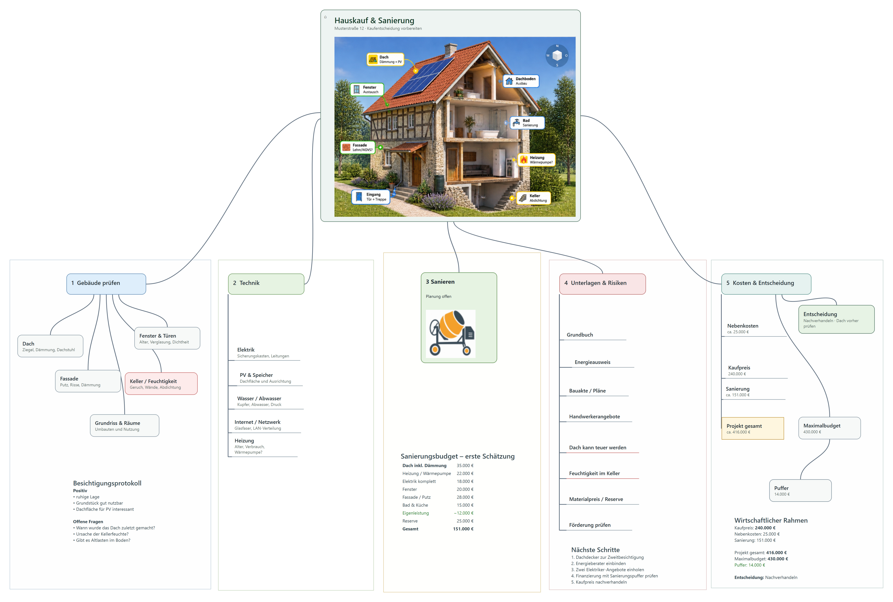

# Excogitare

**Engineering Knowledge Workspace based on Mindmaps**

Collect your knowledge.  
Connect your ideas.  
Master complexity.

**Your engineering desk. Reinvented.**

## About

Excogitare is currently an experimental mindmap-based workspace.

The first development goal is a stable and intuitive mindmapping application.
The broader Engineering Knowledge Workspace concept will evolve based on real user feedback.

## Status

Early development / prototype.

Current focus:

- Stability
- Usability
- PDF export
- Beta preparation